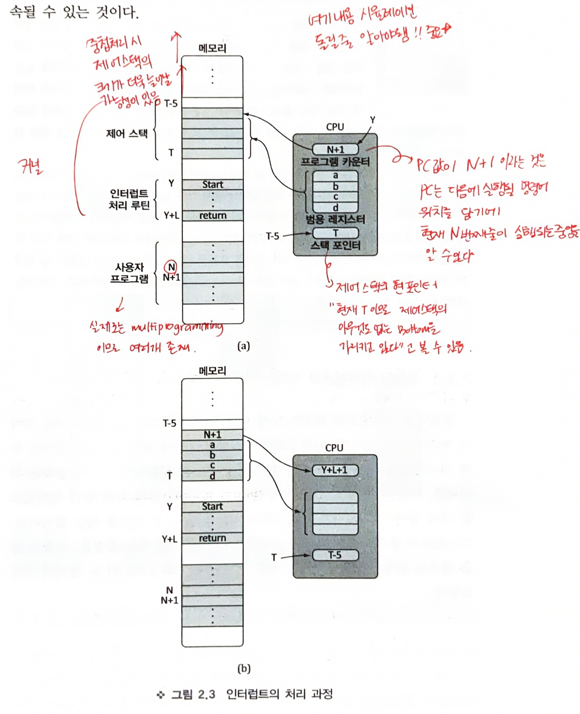
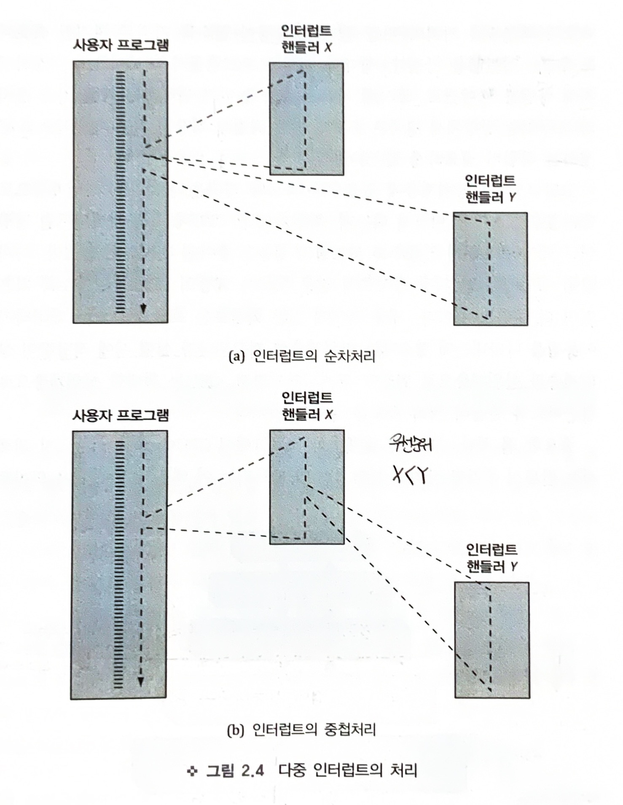
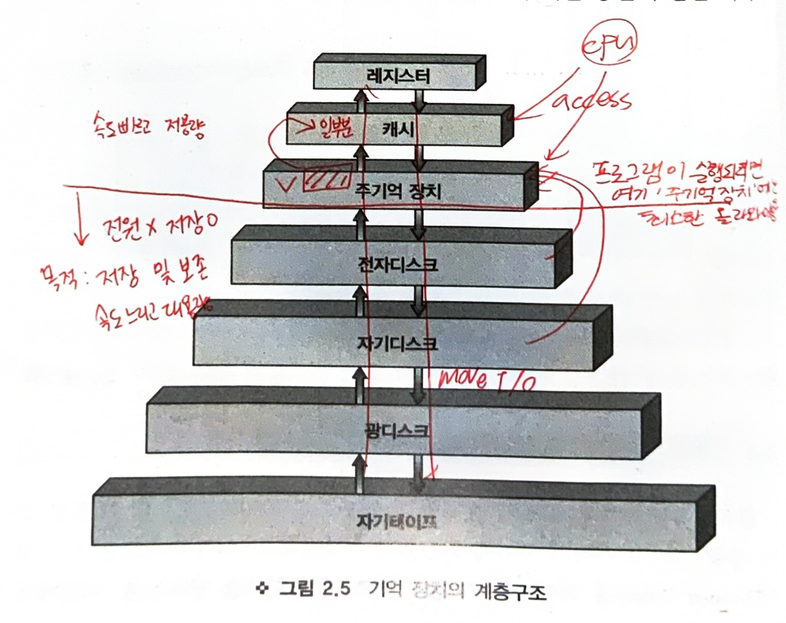

# Chapter2

# 2.1 OS의 목적

운영체제 : 

- 사용자와 컴퓨터 사이의 가교 역할
- 하드 웨어의 컴퓨터 시스템 자원들을 효율적으로 사용되도록 제어하는 역할

# 2.2 몇가지 상식

## 2.2.1 부팅

 부팅 : 

- 전원을 키면, 커널이 메모리에 올라와, 장치들을 준비시키고 각종 레지스터 값을 초기화하고 나서 사용자의 입력을 받을 준비를 마치면 부팅 되었다고 한다
- 부트 프로그램, 또는 부츠트랩로더(Bootstrap Loader) : 커널을 찾아, 메모리에 올려 실행시켜 주는데 이용, ROM에 저장되어 있다.
- PC의 부팅 : 부츠트랩 로더(ROM)가 먼저 부트 프로그램(디스크)을 메모리에 올려 실행 시키면, 부트 프로그램이 커널을 올려 실행시켜주는 방식

## 2.2.2 레지스터

CPU는 여러 개의 레지스터를 갖고 있다

### 레지스터

1. 레지스터는 메모리보다 빠른 기억 장치, 8비트 16비트 32비트 등의 작은 크기를 가진다.
2. 데이터 레지스터, 주소 레지스터, 조건 코드 레지스터가 있다
    
    **데이터 레지스터**
    
    연산을 위해 사용(메모리보다 레지스터의 데이터 연산이 더 빠름)
    
    **주소 레지스터**
    
    데이터나 명령어의 메모리 주소를 저장하거나 계산하는데 사용
    
    ex) 인덱스 레지스터 : 주소 지정
    
    ex) 세그먼트 포인터, 스택 포인터 : 해당 포인터 값을 저장
    
    **조건 코드 레지스터**
    
    **CPU 연산을 제어하기 위해 사용하는 레지스터**
    
    MBR, MAR, IR , PC 등
    
    PSW(Program Status Word) : 
    
    - 프로그램 상태 워드 레지스터 : 모든 CPU가 가지고 있으며, 현재의 상태 정보를 저장
    - 여러가지 조건(Condition)  코드와 인터럽트 가능, 불가능을 표시하는 비트, 현재 실행 모드를 나타내는 비트를 포함

## 2.2.3 명령어 처리

명령문 : statement

명령어 : instruction

명령어 하나를 처리하는 절차

1. Fetch( 반입 ) : 메모리에 있는 명령어를 읽어 처리기에 있는 레지스터로 갖고 온다. (이때 위에서 말한 연산 제어 레지스터 동원) 
2. 연산의 종류를 파악하고 실제로 실행
3. 1~2의 과정을 명령어 전체를 반복하며 전체 프로그램의 실행이 완료

주의 : 반입과정에서 ‘**다음에 실행 해야할 메모리에 있는 명령어 주소** ‘ 는 PC레지스터가 저장하고 있다.

→ 인터럽트 명령어 실행 주기

시작 → 명령어 반입 (decode) → 실행 → 인터럽트 확인 및 처리

# 2.3 인터럽트

운영체제는 자원을 효율적으로 관리 해야 한다 → 그러기 위해 현재 각 자원의 상황을 파악할 수 있어야함

### 자원의 상황을 파악하는 방법

1. 폴링(Polling) : CPU가 일정한 시간 간격을 두고 각 자원들의 상태를 주기적으로 확인하는 방식\
    
    단점: 각 자원들은 직전 풀링 이후 변화된 상태를 다음 폴링 까지 아
    
    1. 각 자원들은 직전 폴링 이후 변화된 상태를 다음 폴링 까지 알릴 수 없다
    2. 아무 일이 없는 데도 cpu는 폴링에 일정량의 시간을 들여야한다.
    3. 폴링의 시간 가격을 적절히 정해야한다.
    4. 
    
2. 인터럽트  : 각 자원들이 능동적으로 자신의 상태변화를 CPU에게 알리는 방식
    
    장점 : 
    
    1. cpu는 따로 시간을 들이지 않아도 된다
    2. 자원들은 상황 발생 시 즉시 알려 처리 받을 수 있다.

<aside>
❓ 자원 : 여기서 자원은, 하드웨어 자원, 즉 장치나 주변장치들을 의미.                                                    ‘하드웨어 인터럽트’  : 이 자원들로부터의 인터럽트를 라 한다.                                                                                ‘소프트웨어 인터럽트’  : 실행중인 cpu 스스로 자신에게 인터럽트를 해야할 때 , 실행중인 명령어 때문에 생김 , 시스템 콜도 소프트웨어 인터럽트다.                                                                                                                     ex) 오류를 발생시키는 명령(0으로 나누거나 다른 사용자 주소 참조 등)                                       트랩(TRAP) : 위와 같이 cpu 스스로 자신에게 인터럽트를 해야하는 경우

</aside>

## 2.3.1 인터럽트는 언제 처리될까?

하드웨어 인터럽트는 현재 진행 중인 **명령어 실행 을 마친 후** 처리된다.]

트랩은 처리 중인 명령어에 의해 발생되므로, 오류의 경우는 **즉시 프로그램 종료**를 가져오고, 입출력의 시스템 콜은 입출력이 완료되어야 **실행 중인 명령어가 완료되고 바로 이어서** 다음 실행문으로 진행 될 것이다

#인터럽트는 매우 자주 일어나야 하므로, 커널에 넣어둬야 함.

## 2.3.2 인터럽트는 어떻게 처리될까?

1. 장치가 인터럽트 신호를 CPU에게 보낸다
2. CPU는 명령어를 실행 중이었다면 먼저 이명령어 실행을 완료하고 인터럽트 신호를 확인한다
3. 인터럽트 처리 루틴 실행을 위하여,  그전에 실행 중이던 프로그램이 인터럽트 처리 후에 재실행 될 때를 위하여 현상태 정보를 **시스템 스택**에 저장한다
    
    이때, 현상태 정보란 PSW, PC레지스터의 값등을 말함
    
4. 인터럽트 처리 루틴의 시작 주소를 PC에 넣어 실행시킨다 → 인터럽트 처리 루팅 실행
5. 인터럽트 처리 루틴은 먼저 CPU에 있는 레지스터들의 값을 저장한 후(처리 루틴이 진행되며 훼손의 가능성이 있으므로), 필요한 인터럽트 처리를 시작한다
6. 인터럽트 처리가 끝나면, 이전에 저장했던 레지스터 값들을 다시 재저장(Restore) 한 후 PWS,PC 값들을 원래의 자리에 다시 넣어주고 실행한다 . (이때 PC값이 인터럽트 이전에 실행 중이던 프로그램에서 다음에 실행할 명령어 위치 이므로 자연스럽게 프로그램의 실행을 이어 나갈 수 있게 됨)

<설명>

1. (a)의 상황은 인터럽트 직전의 레지스터들의 값이다.
2. PC 값이 N+1 이라는 것은 , 현재 수행중인 명령어가 N번지라는 뜻
3. 스택 포인터의 값 T의 메모리 위치가 제어스택(Control Stack)의 맨 아래이고 저장되어있는 값이 아무것도 없다는 사실을 알 수 있다.

인터럽트 처리 과정 

1. 기존 레지스터 값들을 저장해야 하므로, 범용 레지스터(그림에서는 4개)와 PC에 있는 값을 제어 스택에 저장하고 스택 포인터 값을 T-5로 바꾼다
2. PC에는 서비스 루틴의 시작 번지인 Y를 넣어주면 Y번지의 명령어가 실행되는 서비스 루틴이 시작된다.

서비스 루틴 완료 후

1. 서비스 루틴의 마지막 명령어 실행 후 (b)와 같이 사용자 프로그램이 재실행될 환경을 만들어야한다.
2. 스택 포인터의 값(T-5) 으로  스택에 보관해둔 값을 찾아 범용 및 pc 레지스터에 복구하고, 스택 포인터 값은 빠진 만큼 다시 T로 조정된다
3. PC의 바뀐값인 N+1번지의 명령어를 실행하면 자연스럽게 사용자 프로그램 실행이 이어진다.

<aside>
❓ 문맥 교환이란?                                                                                                                                                            문맥 교환(Context Switching) 은 현재까지 하던 일에서 잠시 다른일을 해야 할 때, 작업대(CPU)가 같은 곳이어야 한다면, 우리의 **현재까지의 모양이나 내용(문맥: 상태정보를 포함한 처리기 레지스터들의 값)**을 그대로 가까운 어딘가에 ‘보관’ 했다가 나중에 다시 보관되어있던 상태로 일을 이어나간다.                                                                                                   즉, 프로세스 상태 블록(Process Control Block) 의 전부 혹은 일부분을 문맥이라 본다.

</aside>

## 2.3.3 중첩된 인터럽트의 처리는?

(다중 인터럽트의 처리)

1. 순차적 처리 : 인터럽트를 처리하는 동안 발생하는 인터럽트는 현재 처리가 끝난 뒤 바로 처리해주는 방식, 차례대로 해준다는 의미
2. 중첩 처리  : 중첩이 가능하도록 현재 처리 중 인터럽트를 잠시 접어두고 또 다른 인터럽트로 실행을 옮길 수 있도록 하는 방식
3. 인터럽트의 중요도에 따라 우선순위가 더 높은 경우 중첩을 , 아닌 경우 순차적으로 구현하는 것도 방법이다.

# 2.4 기억 장치의 계층적 구조

컴퓨터 시스템의 저장장치는 ‘속도, 용량, 가격’의 차이로 분류가 가능하다

속도는 ‘접근 시간(Access Time)’ , 가격은 ‘비트 당 단가’ 를 뜻한다.

속도가 빠를수록 가격이 비싸며, 용량이 클수록 가격은 싸지만 속도가 느리다

→ 방대한 양을 저장하기 위해 용량은 크고, 동시에 처리 속도를 높이기 위해서는 **계층적으로 저장장치를 구성하는 방식**을 쓴다.

아래 그림을 보면 상위 계층에 있을 수록 성능이 좋다. , 다시 말해 CPU에 의한 저장 장치로의 접근 횟수가 계층의 아래에 있을 수록 적은 것이 좋다.

→ 평소에는 하위 계층에 저장되다 실행 시 적당량이 상위 계층으로 교체되어지면서 CPU는 최대한 상위 계층으로 접근하도록 만들어 처리 속도를 높인다.

<실행될 명령어의 실행과정>

메모리→ 캐시 → 처리기 레지스터 : 이 과정에서 메모리 관리는 어떻게 하는지에 따라 시스템 성능이  달라지므로 운영체제의 역할이 중요하다. (캐시와 처리기 레지스터는 하드웨어가 제어하기 때문에 논외)

계층적 구조 의 설계는 계층 간 데이터가 이동되는  데 드는 부담(저장장치 사이 입출력에 드는 비용) 을 동반하지만 상위계층 접근을 통해 **처리 시간의 절약**이 부담을 충분히 보상하므로 대부분에서 차용한다.

# 2.5 I/O 방식

입출력을 하기 위해 시스템이 사용하는 방식

## CPU개입 정도에 따라 분류

알아야 할 사실 : 각 입출력 장치는 ‘**컨트롤러**’ 가 있고, 여기에 cpu와 입출력할 데이터를 저장하는 **‘버퍼’**가 있다

만약 디스크로 부터 10개의 워드를 메모리로 읽어와야 할 입력의 경우, 

디스크 컨트롤러의 버퍼 크기가 1워드 크기라면, 

디스크의 데이터는 워드 단위로 버퍼에 채워진 후 ,  cpu에게 인터럽트로 알리고 

cpu는 버퍼의 내용을 메모리로 옮긴 후 다음 워드의 입력을 다시 지시한다. 

⇒ 결과적으로 10번의 인터럽트가 실행되고 전체 입력이 완료될 것이다.

### 프로그램에 의한 입출력 (Programmed I/O)

- CPU는 입력을 지시한 후, 한 워드가 컨트롤러 버퍼에 입력됐는지를 계속해서 확인하는 방식
- 입력 확인 작업이, 입출력 담당의 시스템 소프트웨어에 의한 것이므로 프로그램에 의한 입출력이라고 한다.
- 입력의 완료를 알릴 때 인터럽트가 필요 없는 대신, CPU가 지속적으로 완료의 여부를 확인해야 한다.

⇒ 전체 입출력이 완료 될 때까지 CPU는 다른 작업에 동원되지 못하므로 낭비된다.

### 인터럽트에 의한 입출력(Interrupt- driven I/O) : 현재 대부분에서 사용됨

- 입력을 지시한 후 한 워드의 입력이 이루어지는 사이에 CPU는 다른 작업에 활용(다른 프로그램 실행) , 되며, 입력 완료 시 인터럽트를 통해 CPU에 알려진다.

⇒ 여러번의 인터럽트 처리가 필요하지만, 프로그램에 의한 입출력 때의 CPU낭비가 없다.

굳이~ 단점을 찾자면 계속 CHECK하는 것이 아니라, I/o처리 완료 후 즉시 다음 작업으로 넘어가지는 못한다.

### 메모리에 직접 접근하는 입출력(Direct Memory Access, DMA)

- 인터럽트에 의한 입출력의 단점 : 버퍼의 크기에 비해 입출력 데이터가 클수록 인터럽트 처리가 잦게 요구된다→ 이 횟수를 줄이고자 진화한 방식이 DMA
- 입출력 작업을 CPU대신 해 줄 수 있는 **채널(입출력 전용 처리장치)**이라는 **위성 프로세서**가 필요하다.
- CPU는 입출력 할 데이터의 시작주소와 크기를 채널에게 알려주고, 다른 작업에 동원된다. 이때 입출력은 채널의 주도하에 이루어진다.
- 시스템에서 한 번의 입출력 단위 : 블록
- 채널은 블록단위로 CPU에게 인터럽트를 보내 알린다.

⇒ 한 블록 크기를 열 개의 워드라 할 경우, CPU는 한번의 인터럽트만 처리하면 되기에 인터럽트의 횟수를 줄일 수 있다. 

은행 시스템 처럼 I/O가 매우 많을 경우에 DMA 사용

<aside>
❓ CPU와 채널의 관계                                                                                                                                   우연히 똑같은 시간에 CPU와 채널이 메모리에 접근 요구를 해오면,                                            메모리는 동시에 접근이 불가하고 한번에 하나의 워드만 접근가능 하기때문에,  우선순위를 결정해 줘야 한다. 일반적으로 CPU가 속도 가 빨라서 평소 메모리 접근 기회를 더 많이 가지기 때문에, 이 때 만이라도 채널에게 우선적 기회를 주어 원활한 입출력이 이루어지도록 하는 것이 공평하다고 보고 그렇게 설계한다. ⇒ 이를 **채널이 CPU의 메모리 접근 사이클을 훔친다** 고 해서  **Cycle Stealing** 이라 부른다.

</aside>

DMA와 Cycle Stealing을 묶어서 연상하기!

## 하드웨어 구성에 따라 분류

### 독립적인 입출력(Isolated I/O)

- 입출력 장치들이 입출력 버스(I/O 버스)를 통해 CPU와 연결되어 있는 경우
- 이때 메모리는 따로 ‘메모리 버스’로 연결되어있다
- 입출력은 입출력 담당 명령어를 통해 실행된다
- 입출력 버스를 통해 해당 장치의 지정, 데이터, 입출력을 구분해 주는 제어(Control) 값이 전달 된다

⇒ 단점 : 입출력 명령어가 명령어 집합(Instruction Set) 에 추가되므로 제어 로직이 복잡해지고, 입출력 버스를 장착하는데 추가 비용이 필요하다

< 그림 추가>

### 메모리 주소지정 입출력(Memory-mapped I/O)

- 입출력 장치들이 메모리와 함께 메모리 버스에 연결 되어있다
- 입출력을 위한 명령어가 따로 없고, 메모리에 대한 명령어 (MOVE, LOAD) 를 사용하여 실제 입출력을 한다
- 입출력 장치들은 각각 메모리의 한 번지를 할당 받아 그 번지로의 MOVE, LOAD 작업은 곧 그번지에 해당하는 장치로의 입출력이 되도록 하는 것이다

⇒ 단점 : 입출력 장치가 두 개이고 주소의 크기가 3비트라면 실제 메모리는 0번지부터 5번지를 가지는 크기이고, 6,7번지는 입출력 장치는 나타내도록 하는 것인데, **주소 공간만큼의 메모리를 활용할 수 없다는 단점 존재** 

⇒ **‘방식은 Interrupt I/O, 구성은 Isolated I/O 사용’** 이런식으로 표현
